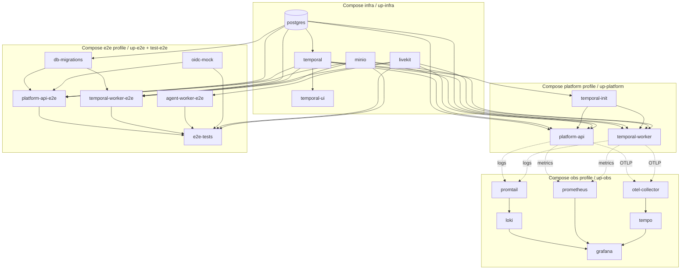

# Execution Plan: Compose To k3d Migration And Test Split

> **Status:** Active
> **Created:** 2026-03-17
> **Owner:** Jakit
> **Track:** Runtime deprecation + proof hygiene

## 1. Goal

Deprecate the root local Docker Compose stack without lying about readiness.

That means:

- replace Compose with `k3d` only where the Kubernetes path is equally deterministic
- keep Compose where `k3d` is still missing real parity instead of pretending otherwise
- split tests mechanically so the repo knows which proof lane belongs to Compose, which lane is `k3d`-ready, and which lane is safe to ship in an NFQ-only source bundle

## 2. Source Anchors

- `docker-compose.yml`
- `tools/scripts/compose-worktree.sh`
- `tools/scripts/k3d-up.sh`
- `tools/scripts/k3d-test-e2e.sh`
- `wiki/architecture/ci.md`
- `wiki/ops/local-observability.md`
- `wiki/ops/harness_engineering.md`
- `wiki/testing/regression-coverage.md`
- `wiki/ops/k3d-local-stack.md`
- `infra/k8s/README.md`
- `docs/milestones/exec-plans/clinic_v2_vox_nfq_priority_tracker.md`
- `docs/milestones/exec-plans/platform_observability_backend_execution_plan.md`
- `docs/milestones/exec-plans/v2_ui_ux_control_system_execution_plan.md`
- `docs/milestones/exec-plans/nfq_source_distribution_separation.md`

## 3. Checklist Rows This Plan Supports

This plan exists to support real completion behind:

1. `docs/requirements/checklist.md:53`
   - operator-grade observability is materially in-product but still missing deeper proof and product depth
2. `docs/requirements/checklist.md:226-233`
   - call monitoring rows where runtime proof and operator-visible evidence still matter
3. `docs/requirements/checklist.md:413-429`
   - NFQ clinic rows where operator-visible booking and observability proof still matter more than backend-only claims

Adjacent context, not direct source-handoff contract:

- `docs/requirements/checklist.md:82-83`
  - solution/capability gating is related repo context, but it is not the actual NFQ source-distribution contract

If a change does not improve runtime-proof truth or NFQ-safe test/source boundaries, it is probably scope trash.

## 4. Current Truth

Already real:

- the root Compose stack still provides the fastest local runtime for inner-loop platform bring-up, PR smoke, and many `*_compose.py` suites
- `k3d` already provides the closest local parity for Kubernetes-first deployment behavior
- the observability endgame already says this clearly: Compose and `k3d` are different tools, not rival religions
- `tools/scripts/compose-worktree.sh` still owns a lot of local workflow reality:
  - `up-infra`
  - `up-platform`
  - `up-obs`
  - `up-e2e`
  - `test-e2e`
- `tools/scripts/k3d-test-e2e.sh` already proves serious value for cluster-parity runs and patches the real workloads

Not real enough yet:

- `k3d` is not yet a clean drop-in replacement for Compose `up-e2e`
- `k3d` still relies on a host-side OIDC mock instead of a boring in-cluster equivalent
- the root Compose observability stack has Loki + Tempo + `otel-collector` truth documented in `wiki/ops/local-observability.md`, and the local `k3d` docs do not yet replace that story cleanly
- `temporal-init` and `db-migrations` do not yet have a documented boring Kubernetes-native replacement path with the same local determinism
- many tests are still coupled to Compose naming, service startup, and harness assumptions
- the NFQ source-handoff plan still lacks the test split needed to ship only the right proof bundle
- the traceability parity contract already lives in `wiki/ops/harness_engineering.md`; this plan must stay subordinate to that existing truth instead of inventing a second observability doctrine

## 5. Root Compose Dependency Graph

## 6. k3d Replacement Map

| Compose surface | Current job | k3d counterpart | Current blocker | Status |
| --- | --- | --- | --- | --- |
| `postgres` | app + worker database | CloudNativePG `platform-postgres-rw` | already real; keep port-forward/docs boring | Ready |
| `temporal` | workflow backend | Temporal Helm release / `temporal-frontend` | already real; keep bootstrap deterministic | Ready |
| `temporal-ui` | workflow inspection | `temporal-web` | already real | Ready |
| `livekit` | voice runtime | LiveKit Helm release + shared Redis + SIP | already real, but keep local voice proof boring | Ready |
| `minio` | object storage | in-cluster MinIO | already real | Ready |
| `temporal-init` | namespace/bootstrap prep | bootstrap logic in `k3d-up.sh` or a real Job | not a clean first-class Job yet | Partial |
| `platform-api` | app runtime | `Deployment/platform-api` | already real | Ready |
| `temporal-worker` | workflow worker | `Deployment/platform-temporal-worker` | already real | Ready |
| `agent-worker-e2e` | voice/agent e2e worker | `Deployment/agent-worker` | already real | Ready |
| `db-migrations` | schema prep for tests | Kubernetes Job or deterministic bootstrap stage | still too script-shaped | Partial |
| `oidc-mock` | auth dependency for local tests | in-cluster mock or formal host-side contract | current `k3d` lane still starts host-side mock | Blocked |
| `loki` + `promtail` | local logs proof | none documented as first-class local `k3d` parity | no boring parity path yet | Blocked |
| `tempo` + `otel-collector` | local trace ingestion proof | none documented as first-class local `k3d` parity | no boring parity path yet | Blocked |
| `prometheus` + `grafana` | local metrics dashboards | kube-prometheus-stack | already real | Ready |

## 7. Test Split Model

Do not keep arguing about “the test suite” as if it is one thing. That is lazy.

Split it into three runtime buckets plus one export overlay:

These are draft planning labels only.

They are informed by the existing regression ownership in `wiki/testing/regression-coverage.md` and the current CI routing in `wiki/architecture/ci.md`.

They do not replace the canonical regression tiers or harness ownership, and they are not part of current CI routing yet.

Until a real owner file or consuming script exists, treat these labels as planning language, not as an enforced manifest.

### Bucket A: `compose_primary`

Use when the proof still depends on Compose-specific wiring and `k3d` is not yet equally deterministic.

Examples:

- `packages/platform-core/tests/e2e/*_compose.py`
- local observability debugging flows that still need Loki/Tempo/`otel-collector`
- any test coupled to `compose-worktree.sh up-e2e`

Rule:

- keep these on Compose until the Kubernetes lane is honestly as boring and reliable

### Bucket B: `k3d_primary`

Use when the thing being proven is really cluster behavior.

Examples:

- ingress, rollout, secret injection, service routing, pod env, and cluster parity paths
- any lane where Compose can only provide fake comfort

Rule:

- default to `k3d` when the product claim is Kubernetes-specific

### Bucket C: `dual_runtime_required`

Use when the repo must prove both inner-loop determinism and cluster parity.

Examples:

- observability truth the clinic/operator UI depends on, especially the traceability harness paths already defined in `wiki/ops/harness_engineering.md`
- clinic/operator evidence lanes where the current delivery tracker explicitly requires booked-in-Docker inner-loop proof plus operator-visible latency/transcript truth before calling P0 closed

Rule:

- keep both lanes until the cheaper lane can be killed without losing proof quality
- for observability specifically, the current operator-evidence contract already has verified Compose and `k3d` modes; dual-runtime means those proof modes are both still intentionally kept, not that operator UI proof is blocked on Compose `up-obs`
- the existing `external` traceability mode remains a separate proof mode owned by the current harness contract

## 8. Initial Test Split Proposal

| Lane | What belongs here now | Why |
| --- | --- | --- |
| `compose_primary` | root `compose-worktree.sh` flows, most `*_compose.py`, local obs/debugging flows that still depend on Loki/Tempo/collector | `k3d` parity is not yet boring enough |
| `k3d_primary` | cluster-parity E2E, ingress/auth/rollout verification, anything whose claim is Kubernetes-first | Compose cannot prove the real topology |
| `dual_runtime_required` | traceability/operator evidence slices whose current contract intentionally keeps both Compose inner-loop proof and `k3d` parity | one runtime alone would be fake confidence |

## 9. Export Eligibility Overlay

`nfq_export_allowed` is not a runtime lane.

It is a separate export-eligibility flag that can sit on top of any runtime classification.

Rules:

- allowlist only
- exclude VOX/public-ingress/other-solution leakage
- forbid imports from excluded solutions and excluded fixtures
- if a test needs Compose or `k3d`, that is fine; the separate question is whether NFQ should receive it at all
- this overlay must not replace the runtime classification already governed by the three runtime buckets above

## 10. Migration Board

| Compose command / surface | What it currently proves | k3d destination | Kill criteria | Test split impact | Status |
| --- | --- | --- | --- | --- | --- |
| `up-infra` | local DB + Temporal + LiveKit + MinIO | `k3d-up.sh` default local stack | team can bring up the same dependencies with `k3d` fast enough that Compose is not the default convenience crutch | shifts infra smoke from `compose_primary` to `k3d_primary` or `dual_runtime_required` depending on claim | Candidate first |
| `up-platform` | local app + worker runtime | in-cluster `platform-api` + `platform-temporal-worker` | clinic P0/operator observability flows are proven via `k3d` without manual nonsense | reduces inner-loop Compose dependence | Candidate first |
| `up-e2e` | schema prep + OIDC mock + app/worker/agent test runtime | cluster bootstrap + Job(s) + in-cluster or formalized OIDC mock | `db-migrations` and `oidc-mock` replacements are real and boring | biggest blocker for moving many tests out of `compose_primary` | Do not kill yet |
| `test-e2e` | Compose-backed E2E execution | `k3d-test-e2e.sh` or runtime-agnostic wrapper | same suites pass with comparable determinism and sane runtime | unlocks real test migration instead of doc theater | Do not kill yet |
| `up-obs` | local logs/metrics/traces with Grafana | kube-prometheus + Loki/Tempo/collector parity or explicit scope reduction | local debugging and host-scrape workflows no longer depend on Compose-only logging/tracing | useful for local observability debugging, but not the sole owner of operator-evidence truth | Do not kill yet |
| `compose-worktree.sh` port/env generation | worktree-safe local isolation | runtime-agnostic environment generator | equivalent boring UX exists for `k3d` flows | affects every local runtime test lane | Keep until replacement exists |

## 11. Deprecation Order

1. Make `k3d` the default documented local platform bring-up for humans who need deployment-parity behavior.
2. Deprecate `up-platform` first, not all Compose at once.
3. Deprecate `up-infra` once local `k3d` is boring enough that Compose is no longer the “just make it run” crutch.
4. Keep `up-e2e` and `test-e2e` until `db-migrations`, OIDC mock, and suite determinism are honestly solved.
5. Keep `up-obs` until local `k3d` has an explicit answer for logs + traces, not just metrics.
6. Only then consider whether the root local Compose stack should disappear entirely.

## 12. Rules For NFQ Test Split

This is the part people usually botch.

Do not mix “what runtime runs the test” with “what customer should receive the test.”

The NFQ handoff lane must produce:

- an explicit allowlist of test paths
- an explicit denylist of excluded solution paths
- a mechanical import check so exported NFQ tests cannot reach excluded solutions through fixtures or helper modules
- a proposed runtime classification manifest or equivalent owner file that says which shipped NFQ tests are `compose_primary`, `k3d_primary`, or `dual_runtime_required` for local runtime ownership
- a separate export-eligibility allowlist or manifest field so shipped tests are not confused with runtime lanes
- explicit note that external proof modes remain governed separately by the current harness contract

That last point matters because handing NFQ a filtered repo with a mystery runtime story is garbage.

## 13. This Week

- [ ] Create the first mechanical runtime classification manifest:
  - `compose_primary`
  - `k3d_primary`
  - `dual_runtime_required`
- [ ] Add a separate `nfq_export_allowed` export flag or allowlist instead of pretending it is a runtime lane
- [ ] Tag the existing Compose-heavy `packages/platform-core/tests/e2e/*_compose.py` inventory instead of pretending the split will happen automatically
- [ ] Decide whether OIDC mock becomes an in-cluster service or a formal host-side contract for `k3d`
- [ ] Define the boring Kubernetes-native replacement for `db-migrations` / `temporal-init`
- [ ] Decide whether local `k3d` observability parity means adding Loki/Tempo/collector or explicitly narrowing what `up-obs` is supposed to prove
- [ ] Link the runtime classification manifest and export allowlist into the NFQ source-handoff export plan before anyone claims the handoff is ready

## 14. Non-Goals

- killing Compose out of ideology
- rewriting every test right now
- pretending metrics-only `k3d` observability is enough to replace the current Compose logs/traces story
- bundling unrelated Hetzner production Compose files into this local-stack deprecation track
